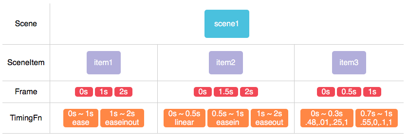

Scene.js
============
Scene.js is an Javascript Aniamtion Library

<br>



## Component
* **Scene** : @@@
* **SceneItem** : @@@
* **Frame** : @@@
* **TimingFunction** : @@@
* **Util** : @@@
> 
* **PropertyObject** : Make String to Property Object for the inner product
> + ex) Util.stringToObject => "rgba(200, 100, 20, 10)" to {prefix: "rgba(", suffix: ")", arr: [200,100, 20,10], separator: ","}
> + ex) Util.stringToObject => "a b c d" to {prefix: "", suffix: "", arr: ["a","b", "c", "d"], separator: " "}

* **Curve** : Make Transition Type with Bezier Curve.
* **Scene.Color** : Convert RGB, HSL HEX4, HEX6 to RGBA Model.

## Support Browser
**Default**

|Internet Explorer|Chrome|FireFox|Safari|Opera|
|---|---|---|---|---|
|9+|Latest|Latest|Latest|Latest|
**Transform**

|Internet Explorer|Chrome|FireFox|Safari|Opera|
|---|---|---|---|---|
|9+|4+|3.5+|3.2+|10.5+|
**Transform 3D**

|Internet Explorer|Chrome|FireFox|Safari|Opera|
|---|---|---|---|---|
|10+|12+|10+|4+|15+|
**Filter**

|Internet Explorer|Chrome|FireFox|Safari|Opera|
|---|---|---|---|---|
|X|18+|35+|6+|15+|


## Demo
http://daybrush.com/Scene.js/sample/circleburst.html


## Usage

```HTML
<script src="Scene.js"></script>

```
 
## Example

```javascript
var element = document.querySelect(".sample")
var scene = new Scene();
var sceneItem = scene.addElement(element); // add Item

sceneItem.setProperty(time, property, value);
// width margin padding height ....


sceneItem.setTransform(time, name, value);
//translate, scale, rotate, skew ....

sceneItem.setFilter(time, name, value);
//blur, brightness, contrast, drop-shadow, grayscale, hue-rotate, invert, opacity, saturate, sepia

var ease= [.42,0,.58,1];
sceneItem.addTimingFunction(startTime, endTime, ease);

scene.play();
        
```
